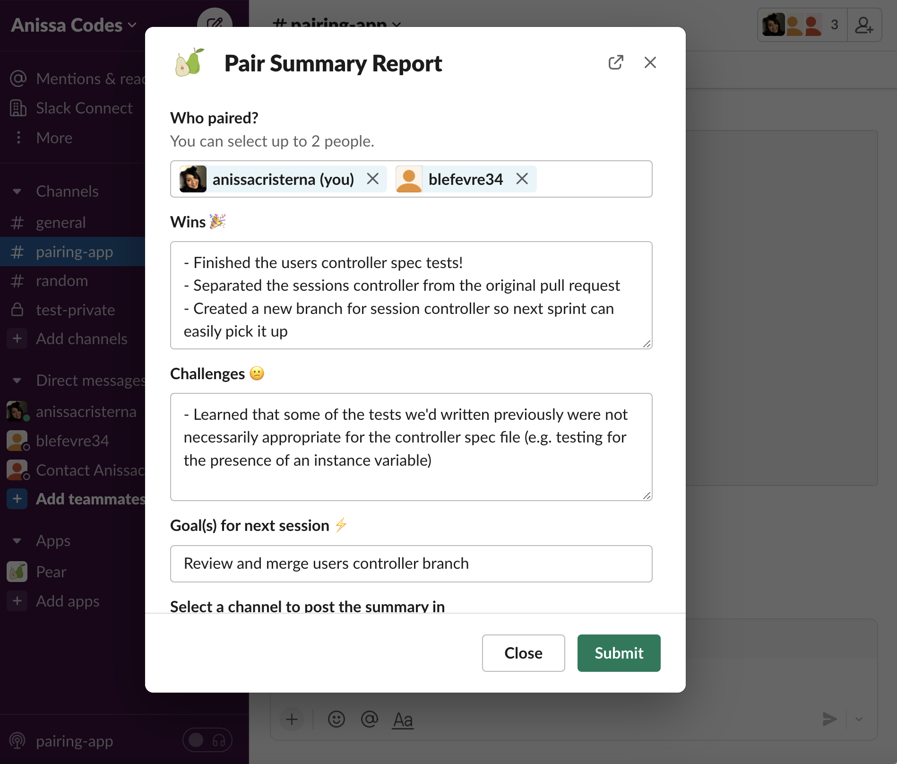

# Pear 

Meet Pear, a simple pair programming Slack app that allows you to share your wins, goals, and challenges or create random pairs for your weekly pairings. 

Pear is built on the [Slack Platform](https://api.slack.com) with Slack's [Bolt Javascript](https://slack.dev/bolt-js/tutorial/getting-started) framework. 

If you want to see the app in action, there's some screenshots below, or you can clone the repo and run it locally. 

## Setup

- [Setup](./docs/setup.md)

## Screenshots

### Pear App Home

### Generating New Pairs

### Input for Pair Summary Reports

### Output for Pair Summary Reports

Your team can't wait to see your 'pear-fect' pairs and summaries!